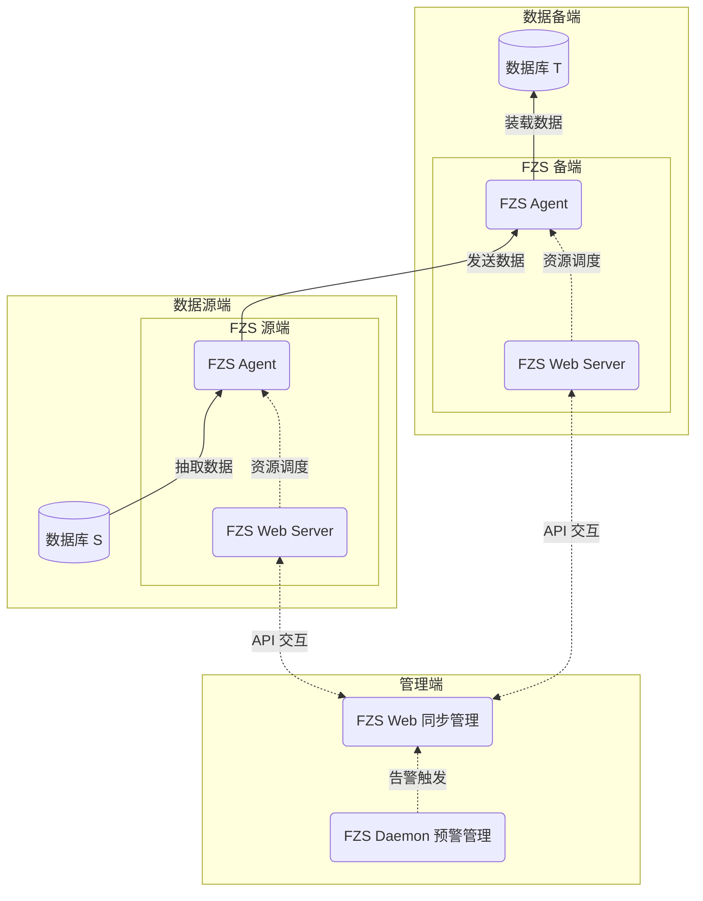

# 技术架构

下图以数据流转的角度，展示了 FZS 的技术架构：

### FZS Agent

FZS 的核心组件，负责数据源端抽取、数据高速传输与数据备端装载。

### FZS Web Server

FZS Agent 与 FZS Web 的服务中间件，对外输出 Restful API 服务。

### FZS Web

FZS 的管理平台，通过对接 FZS Web Server 的 Restful API，实现了数据同步链路的创建、启动、停止、监控等功能。

### FZS Daemon

FZS Web 的预警组件，监听各个同步链路的报错信息，并通过邮件、短信、Webhook 等方式通知管理员用户。