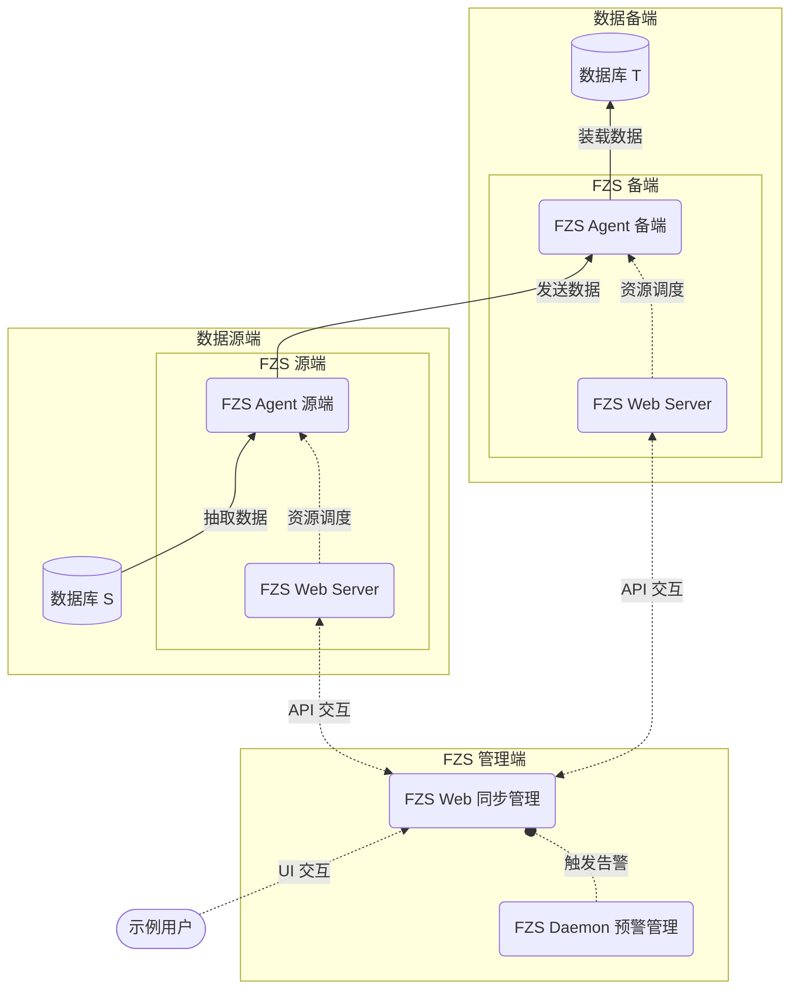

# 系统架构

下图以数据流转的角度，展示了 FZS 的系统架构与核心组件：

如上图所示，示例用户在 FZS Web 上创建同步链路后，FZS Web 会通过与 FZS Web Server 的 API 交互，将同步链路的配置信息下发到源备端各自的 FZS Agent，FZS Agent 源端会根据配置信息，从数据源端抽取数据，经过数据高速传输至 FZS Agent 备端，最后将数据装载到数据备端。

:::note
* 实线箭头 ——> 表示**数据流转方向**
* 虚线箭头 ----> 表示 API 交互方向
* 虚线圆头 ----o 表示触发事件
:::

### FZS Agent

FZS 的核心组件，负责数据源端抽取、数据高速传输与数据备端装载。

### FZS Web Server

FZS Agent 与 FZS Web 的服务中间件，对外输出 Restful API 服务。

### FZS Web

FZS 的管理平台，通过对接 FZS Web Server 的 Restful API，实现了数据同步链路的创建、启动、停止、监控等运维功能。

### FZS Daemon

FZS Web 的预警组件，监听各个同步链路的报错信息，并通过邮件、短信、Webhook 等方式通知管理员用户。