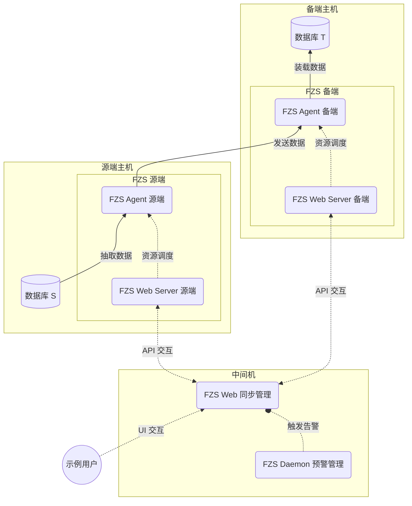
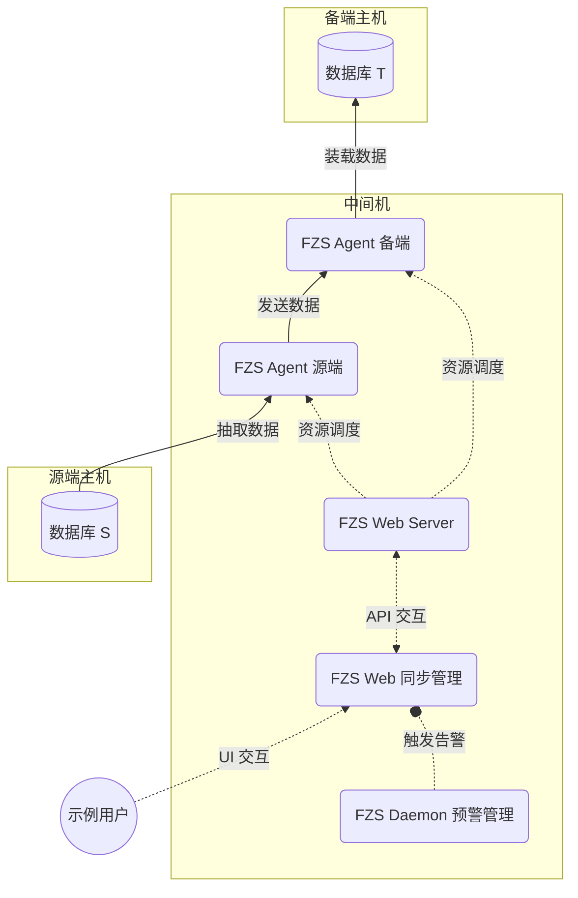

# 部署方式

在核心组件 FZS Agent 的部署拓扑结构的选择上，我们提供：

  - [**点对点**](#performance-first) （性能至上）
  - [**中间机**](#security-first) （安全至上）

两大类私有部署解决方案。每类解决方案都满足不同的业务运行和数据安全的需求，允许用户根据其特定要求选择最合适的选项。

## 点对点 {#performance-first}

对于追求高性能、低时延的用户，我们建议使用点对点部署方式。点对点部署方式下，源端和备端直接通信，不存在任何数据中途流转的环节，数据传输效率高，适用于对数据传输性能要求较高的场景。如下图所示：

为了达到最佳的性能，[FZS Web Server](/fzs-web-server/index.md) 源端和备端需要分别部署在源端和备端主机上，以便对各自的 FZS Agent 进行管理与资源调度，数据库源端和备端之间需要直接通信。

## 中间机 {#security-first}

对于追求数据安全、业务侵入性低的用户，我们建议使用中间机部署方式。中间机部署方式下，源端和备端通过中间机进行数据传输，中间机负责数据的中转，源端和备端之间不直接通信，数据传输过程中不会暴露源端和备端的真实地址，适用于对数据传输安全性要求较高的场景。如下图所示：

为了达到最佳的安全性与最低的业务侵入性，只需一个 [FZS Web Server](/fzs-web-server/index.md) 部署在中间机上，它便可以对源端和备端的 FZS Agent 进行管理与资源调度，实现数据的远程抽取与装载，数据库源端和备端之间不直接通信。